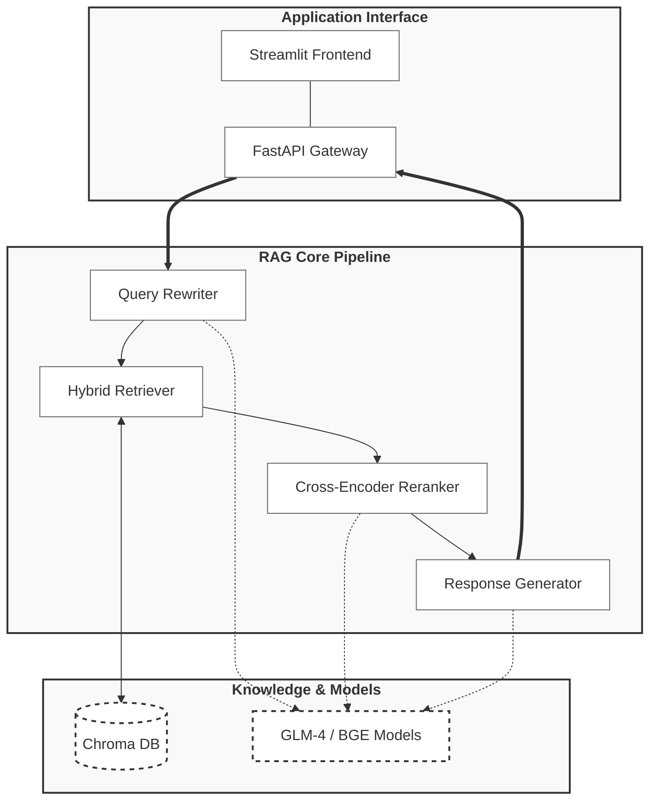
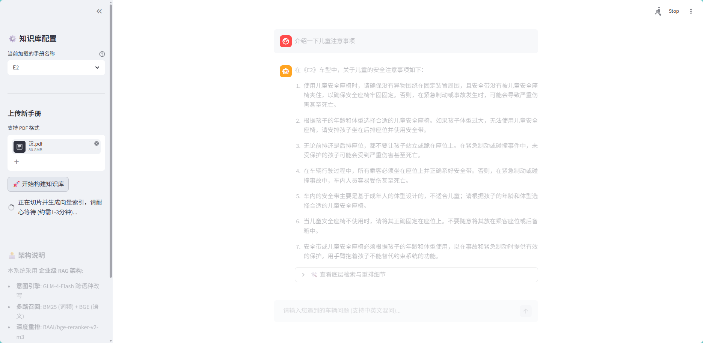
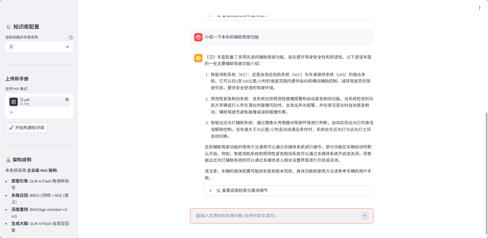

# 🚀 Car-Manual-RAG

<div align="center">
<a href="https://github.com/AoT-oak/Car-Manual-RAG/stargazers">
  
</a>
<a href="https://github.com/AoT-oak/Car-Manual-RAG/network/members">
  
</a>
  
  
</div>


## 📋 目录

- [项目简介](https://www.google.com/search?q=%23项目简介)
- [核心特性](https://www.google.com/search?q=%23核心特性)
- [项目架构](https://www.google.com/search?q=%23项目架构)
- [项目演示](https://www.google.com/search?q=%23项目演示)
- [快速开始](https://www.google.com/search?q=%23快速开始)
- [技术栈](https://www.google.com/search?q=%23技术栈)
- [项目结构](https://www.google.com/search?q=%23项目结构)
- [版本更迭](https://www.google.com/search?q=%23版本更迭)
- [联系方式](https://www.google.com/search?q=%23联系方式)

## 项目简介

本项目是一个专为车载智能座舱与售后维保场景设计的**企业级汽车手册大模型问答系统 (RAG)**。为了解决传统垂直领域大模型容易产生“幻觉”、无法回答特定车型细节的痛点，本系统采用高精度的混合检索架构：通过 BM25（词频）与 BGE（语义）进行多路召回，再由 BAAI Cross-Encoder 进行深度重排打分。配合前后端完全分离的微服务设计，不仅支持动态上传 PDF 实时构建本地知识库，更能为车企前后端提供极速、高并发、结构化的智能问答 API 服务。

## 核心特性

- **🎯 混合多路召回**：突破单一向量检索的局限，融合 BM25 稀疏检索与 BGE 稠密向量检索，确保专业汽车术语与自然语言提问的高效命中。
- **🧠 深度重排机制**：引入 `bge-reranker-v2-m3` 模型，对初步召回的候选文本进行图文级交叉注意力打分，精准剔除无关切片，大幅提升喂给大模型的上下文纯度。
- **🔄 动态知识库引擎**：支持直接通过前端上传 PDF 手册，后端自动化完成文本清洗、递归切片（Recursive Chunking）与 Chroma 向量索引构建，即传即用。
- **⚙️ 工业级解耦架构**：采用 FastAPI 封装标准后端异步微服务，结合 Uvicorn 生命周期管理彻底释放 GPU 资源；提供 Streamlit 响应式交互前端，双端独立部署。

## 项目架构




## 项目演示

###  上传新的用户手册



### 使用新的用户手册进行知识库问答



## 快速开始

### 环境要求

| **环境** | **版本推荐** | **说明**                                                     |
| -------- | ------------ | ------------------------------------------------------------ |
| Python   | 3.10+        | 核心运行环境（开发环境为 3.12）                              |
| CUDA     | 11.8 / 12.1  | 强烈推荐使用 NVIDIA 显卡以加速本地 Embedding 与 Reranker 模型计算 |

### 克隆项目

```bash
git clone https://github.com/AoT-oak/Car-Manual-RAG.git
cd Car-Manual-RAG
```

### 安装依赖

* 项目包含完整且锁定版本的依赖清单，直接安装即可：

```bash
pip install -r requirements.txt
```

### 环境配置

* 系统需要调用智谱大模型（GLM-4-Flash）进行意图重写与最终生成。系统通过 `.env` 文件进行动态配置与密钥隔离：

1. 复制配置模板：

   ```bash
   cp .env.example .env
   ```

2. 打开 `.env` 文件，填入你的配置信息：

   ```text
   # 智谱 AI 开放平台密钥 (必填)
   ZHIPUAI_API_KEY="your_api_key_here"
   
   # 后端服务运行端口 (选填，默认为 8451)
   API_PORT=8451
   
   # 强烈建议将本地模型路径配置在此，避免重复下载
   # EMBEDDING_MODEL_PATH="./models/bge-large-zh-v1.5"
   # RERANKER_MODEL_PATH="./models/bge-reranker-v2-m3"
   ```

🔑 **如何获取智谱 AI API Key**：

* 前往 [智谱 AI 开放平台](https://open.bigmodel.cn/) 注册账号，并在控制台的“API密钥”处生成并复制。

### 准备模型权重

系统依赖北京智源（BAAI）的开源模型。为保证离线推理速度，建议提前下载模型至本地 `models/` 目录中：

1. `bge-large-zh-v1.5`: 用于文档与查询的向量化 (Embedding)。
2. `bge-reranker-v2-m3`: 用于二次精准排序 (Reranker)。

*(若不配置本地路径，首次启动时 `sentence-transformers` 将自动连接 HuggingFace 下载模型权重)*

您可以前往 [GitHub Releases](https://github.com/AoT-oak/Car-Manual-RAG/releases) 下载，或使用百度网盘加速下载：
* 🔗 **百度网盘**: [点击这里](https://pan.baidu.com/s/1xRdKAyE4TPgVchK9dM80ww?pwd=1234) (提取码: 1234)

### 启动服务

项目内置了针对不同操作系统的进程安全一键启动脚本（包含进程清理与生命周期管理）：

| **系统**      | **启动命令**                              | **后端接口端口**             | **前端 UI 端口**        |
| ------------- | ----------------------------------------- | ---------------------------- | ----------------------- |
| **Linux/Mac** | `chmod +x run_linux.sh && ./run_linux.sh` | `http://localhost:8451/docs` | `http://localhost:8501` |
| **Windows**   | 双击运行 `run_windows.bat`                | `http://localhost:8451/docs` | `http://localhost:8501` |

*💡 提示：如果 Linux 系统提示格式错误，请运行 `sed -i 's/\r$//' run_linux.sh` 修复换行符。*

## 技术栈

| **模块**       | **技术选型**          | **说明**                                   |
| -------------- | --------------------- | ------------------------------------------ |
| **前端展示**   | Streamlit             | 快速构建多交互面板与内部链路可视化界面     |
| **后端 API**   | FastAPI + Uvicorn     | 提供极高吞吐量与生命周期管理的 ASGI 微服务 |
| **RAG 编排**   | LangChain             | 串联大模型、提示词模板与数据流管道         |
| **向量数据库** | Chroma DB             | 本地持久化的高效相似度计算与存储引擎       |
| **生成与意图** | ZhipuAI (GLM-4-Flash) | 负责提问词优化重写与最终专业视角的回答生成 |
| **嵌入与重排** | BAAI (BGE 系列)       | 业内顶级的中文多语种语义表示与精排大模型   |

## 项目结构

```text
├── backend/               # FastAPI 异步微服务后端
│   ├── main.py            # API 路由入口与生命周期管理
│   ├── api/               # 数据交互层
│   │   └── schemas.py     # Pydantic 严格数据模型 (Request/Response)
│   └── core/              # RAG 核心业务大脑
│       ├── engine.py      # 全局链路引擎 (加载模型、调度流水线)
│       ├── retriever.py   # 混合召回与重排器 (BM25 + Chroma + Reranker)
│       └── rewriter.py    # 意图改写器 (解决指代消解与语境补全)
├── frontend/              # Streamlit 响应式交互前端
│   └── app.py             # UI 渲染、文件上传与 API 对接
├── vector_dbs/            # 向量数据库持久化挂载目录 (运行时自动生成)
├── models/                # 离线大模型权重存放目录 (需自行放置)
├── run_linux.sh           # Linux/macOS 一键部署启动脚本 (纯英文防乱码)
├── run_windows.bat        # Windows 进程分离一键启动脚本
├── requirements.txt       # 锁定版本的 Python 依赖清单
├── .env.example           # 环境变量配置模板
├── .gitignore             # Git 忽略配置 (屏蔽模型权重、日志与真实密钥)
└── README.md              # 项目说明文档
```

## 版本更迭

- **v1.0.0**: [架构重构] 完成从单体脚本向企业级微服务的演进。引入 FastAPI 与 Streamlit 解耦设计；实装基于动态环境变量的端口与路径防冲突机制；加入 `bge-reranker` 深度重排与严格防幻觉 Prompt 系统。

## 致谢与协议

- 感谢 [LangChain](https://www.google.com/search?q=https://github.com/langchain-ai/langchain) 提供的卓越 LLM 应用开发框架。
- 感谢 [北京智源人工智能研究院 (BAAI)](https://www.google.com/search?q=https://huggingface.co/BAAI) 开源的优质 BGE 嵌入与重排模型。
- 感谢 [智谱 AI](https://open.bigmodel.cn/) 提供的极速 GLM-4-Flash 接口。
- 本项目遵循 [MIT License](https://opensource.org/licenses/MIT) 开源协议。

## 联系方式

如有任何问题、技术交流或实习/工作机会提供，欢迎提交 Issues 或联系作者：

- **Author**: AoT-oak 
- **Email**: m13043736284@163.com
- **GitHub**: https://github.com/AoT-oak
